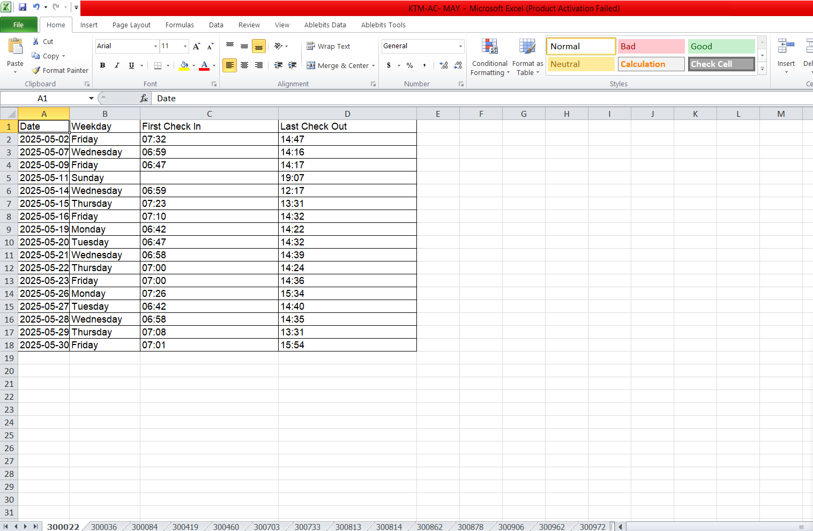
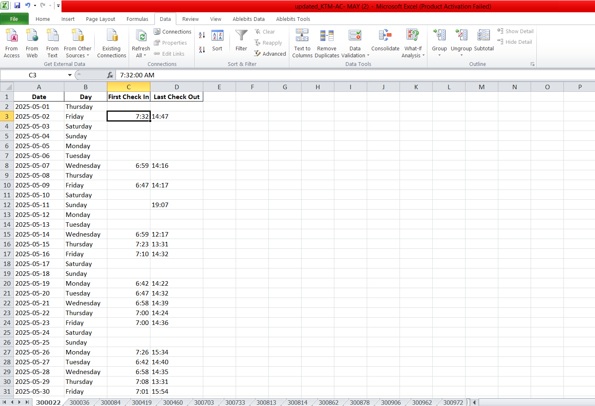
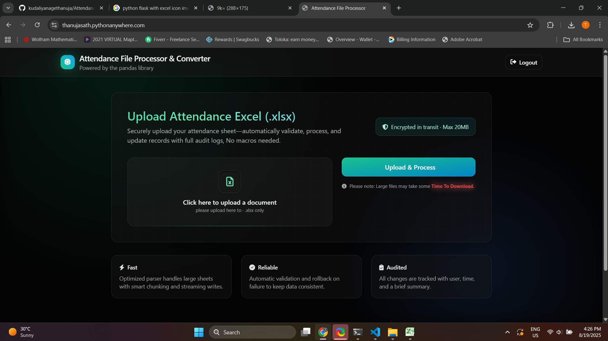

  <a href="https://flask.palletsprojects.com/">
     
  </a>
  <h1 align="center">Flask Attendance Excel Updater</h1>

  
  
  

---

[[Changelog]](./CHANGELOG.md) • [[Issues]](https://github.com/your-username/attendance-excel-updater/issues)

---

Flask Attendance Excel Updater is a lightweight **Excel processor** that:

- Fills missing dates for each month.
- Normalizes the `Day` column automatically.
- Formats check-in/check-out times with **AM/PM**.
- Generates a cleaned-up Excel workbook you can download.

It’s built with **Flask**, **Pandas**, and **OpenPyXL**.

---

## 🚀 Features

- 🔒 Simple login-protected upload interface.  
- 📅 Auto-fills missing dates for the month.  
- 🕑 Formats times like `09:15 AM` / `05:45 PM`.  
- 📊 Works with multiple sheets in one workbook.  
- 📂 Downloads the updated file instantly.  

---

## 📸 Screenshots

>`📌 Problem Overview

Many organizations track attendance using Excel sheets, but the raw data often has issues like: 

- Missing dates in the month.
- Incorrect or inconsistent Day values.
- Check-in and check-out times not formatted consistently (AM/PM confusion).
- Multiple sheets per employee or department, making manual correction tedious.

  
*This leads to inaccurate reports, wasted time, and difficulty calculating attendance or hours worked.` before pushing.*

>`📌 Solution Overview

This Flask project solves the problem by:

- Filling all missing dates for the month automatically.
- Correcting the Day column to match the actual date.
- Standardizing time values to HH:MM AM/PM.
- Preserving any existing check-in/check-out data.

  
*Processing multiple sheets in one workbook and producing a clean, downloadable Excel file.*

>`📌 Web UI Overview

The Flask Attendance File Processor & Converter web interface is designed for simplicity and clarity:

- Clean and modern design with a dark theme for better readability.
- - Upload section: Users can easily drag & drop or click to select their .xlsx attendance files.
- Upload & Process button: Starts the automatic validation and processing of the Excel file.
- Security notice: Highlights that files are encrypted in transit and limited to 20MB.
- Information hints: Explains processing speed and possible delays for large files.

  
*Screenshot:*
This interface ensures that users can upload, process, and download cleaned attendance files quickly and securely, even without technical knowledge.

---

## 📝 How it works

- Upload your Excel workbook (.xlsx).
- The app parses all sheets and builds a complete date range.
- Fills in missing dates for the month.
- Formats check-in/check-out times.
- Downloads a new file: updated_<yourfile>.xlsx.

